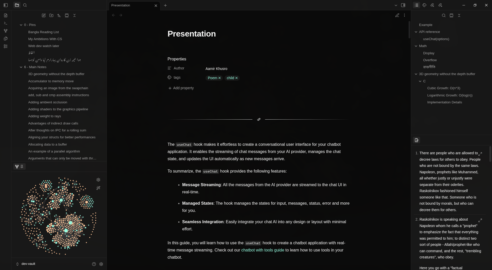
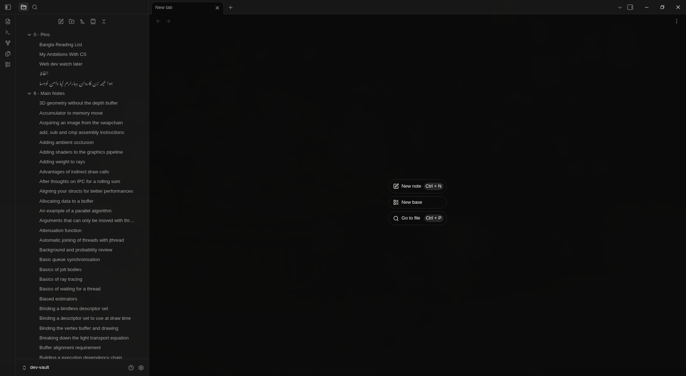
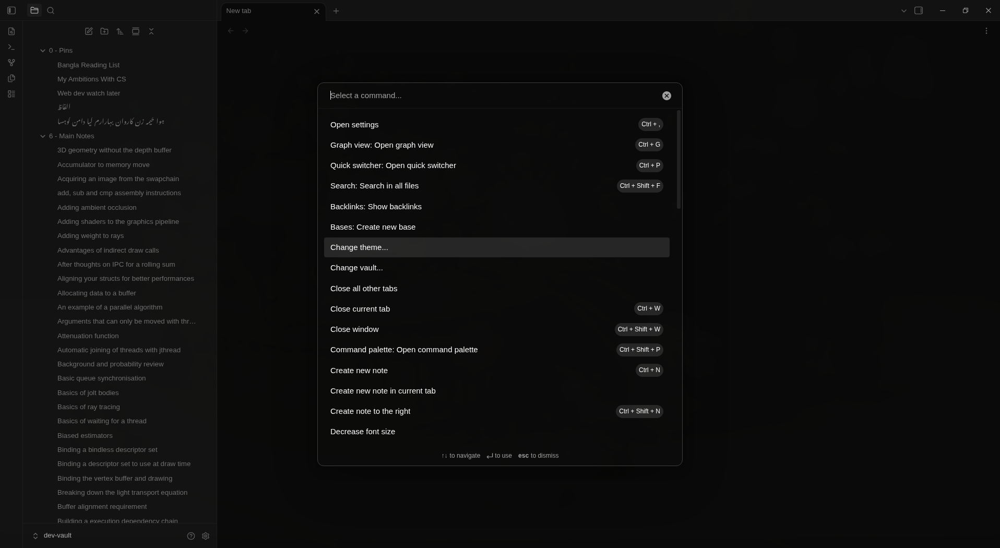

# Fullerene

A dark [Obsidian](https://obsidian.md) theme with clean, web-component-inspired styling, tuned typography, callouts, and syntax highlighting.

> Requires Obsidian **1.10.6+**. Dark mode only.

## Screenshots

## Video Demo

https://github.com/user-attachments/assets/7fb98d0a-1058-43e1-9711-12994f6475ce

## Features

- Refined typography for Latin, Bangla, Urdu/Persian (Nastaliq), and Arabic
- Styled callouts, including `box`, `quote`, `divider`, and `poem`
- Custom code block headers with per-language labels and syntax highlighting
- Styled links, tables, and graph view

## Installation

**Community themes:** Settings → Appearance → Themes → Manage → search "Fullerene".

## License

MIT — see [LICENSE](LICENSE).
